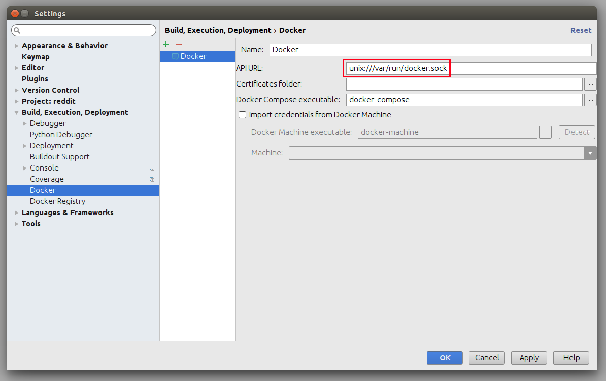
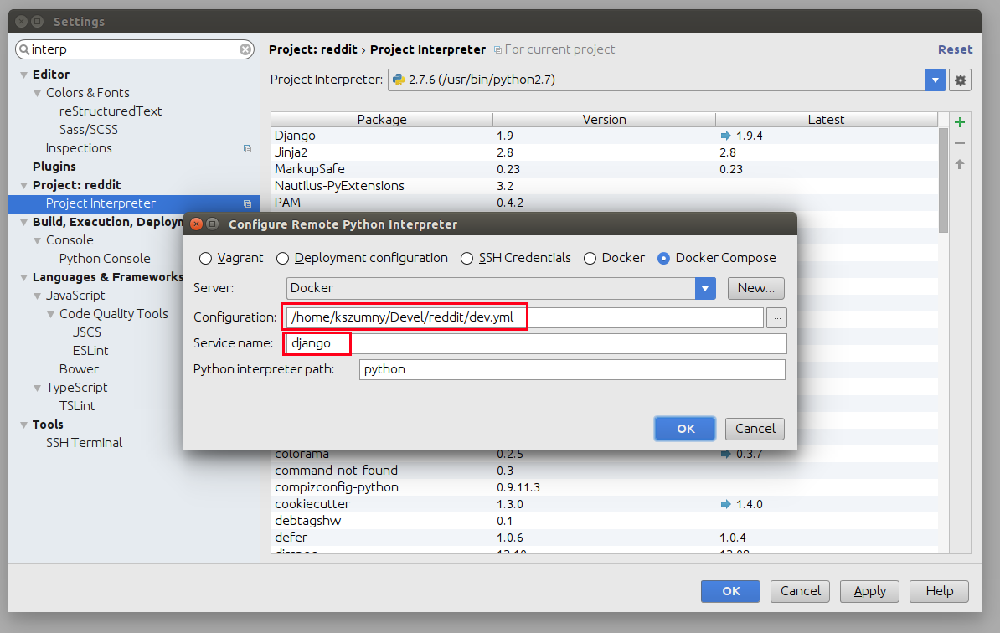
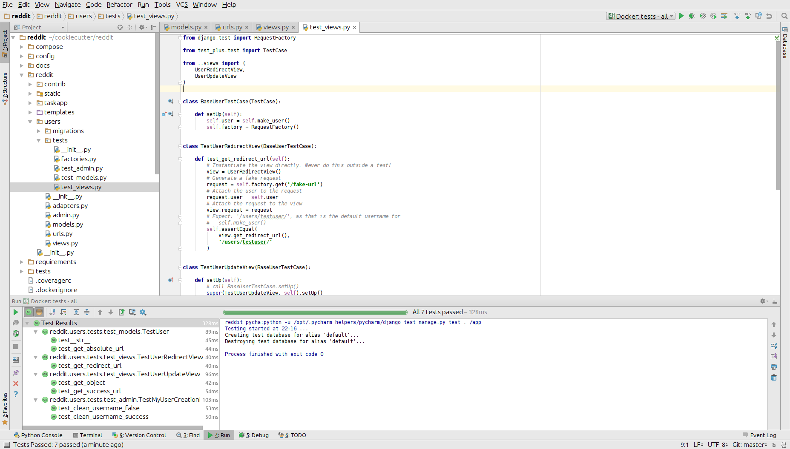
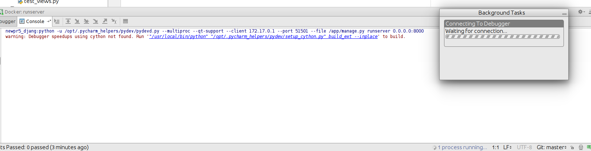

# Docker Remote Debugging

To connect to python remote interpreter inside docker, you have to make sure first, that Pycharm is aware of your docker.

Go to *Settings > Build, Execution, Deployment > Docker*. If you are on linux, you can use docker directly using its socket  `unix:///var/run/docker.sock`, if you are on Windows or Mac, make sure that you have docker-machine installed, then you can simply *Import credentials from Docker Machine*.



## Configure Remote Python Interpreter

This repository comes with already prepared "Run/Debug Configurations" for docker.


But as you can see, at the beginning there is something wrong with them. They have red X on django icon, and they cannot be used, without configuring remote python interpreter. To do that, you have to go to *Settings > Build, Execution, Deployment* first.


Next, you have to add new remote python interpreter, based on already tested deployment settings. Go to *Settings > Project > Project Interpreter*. Click on the cog icon, and click *Add Remote*.


Switch to *Docker Compose* and select `local.yml` file from directory of your project, next set *Service name* to `django`



Having that, click *OK*. Close *Settings* panel, and wait few seconds...


After few seconds, all *Run/Debug Configurations* should be ready to use.


**Things you can do with provided configuration**:

* run and debug python code


* run and debug tests




* run and debug migrations or different django management commands


* and many others..

## Update your Git local repo 

To avoid tracking the changes to the files `.idea/misc.xml` and `.idea/deferred_payment.xml` locally (but maintain them in VCS) do the following
```bash
$ git update-index --assume-unchanged .idea/misc.xml
$ git update-index --assume-unchanged .idea/deferred_payment.xml
```

# Known issues

* Pycharm hangs on "Connecting to Debugger"



This might be fault of your firewall. Take a look on this ticket - [https://youtrack.jetbrains.com/issue/PY-18913](https://youtrack.jetbrains.com/issue/PY-18913)

* Modified files in `.idea` directory

Most of the files from `.idea/` were added to `.gitignore` with a few exceptions, which were made, to provide "ready to go" configuration. After adding remote interpreter some of these files are altered by PyCharm:


In theory you can remove them from repository, but then, other people will lose a ability to initialize a project from provided configurations as you did. To get rid of this annoying state, you can run command::
```bash
$ git update-index --assume-unchanged deferred_payment.iml
```